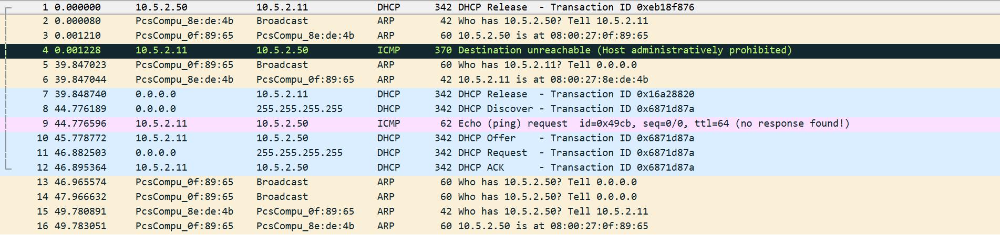

# Compte-rendu du TP5 de CCNA

Compte-rendu réalisé par VERRIER Olivier Groupe B1A.

## Sommaire

* I. [Préparation du lab](#i-préparation-du-lab)

* II. [Lancement et configuration du lab](#ii-lancement-et-configuration-du-lab)

* III. [DHCP](##iii-dhcp)

## I - Préparation du lab

**Réseaux :**

* `net1` : `10.5.1.0/24`
* `net2` : `10.5.2.0/24`
* `net12` : `10.5.12.0/30`

J'ai choisi le réseau `10.5.12.0/30` pour le `net12` car c'est un réseau privé et parce que nous n'avons que 2 routeurs dedans.

**Machines :**

Machine | `net1` | `net2` | `net12`
--- | --- | --- | ---
`client1.tp5.b1` | X | `10.5.2.10` | X
`client2.tp5.b1` | X | `10.5.2.11` | X
`router1.tp5.b1` | `10.5.1.254` | X | `10.5.12.1`
`router2.tp5.b1` | X | `10.5.2.254` | `10.5.12.2`
`server1.tp5.b1` | `10.5.1.10` | X | X

## II - Lancement et configuration du lab

**Checklist IP VMs**

On parle de `client1.tp5.b1`, `client2.tp5.b1` et `server1.tp5.b1` :

* [X] Désactiver SELinux
  * déja fait dans le patron
* [X] Installation de certains paquets réseau
  * déja fait dans le patron
* [X] Désactivation de la carte NAT
  * déja fait dans le patron
* [X] Définition des IPs statiques
* [X] La connexion SSH doit être fonctionnelle
  * une fois fait, vous avez vos trois fenêtres SSH ouvertes, une dans chaque machine
* [X] Définition du nom de domaine

**Checklist IP Routeurs**

On parle de `router1.tp5.b1` et `router2.tp5.b1` :

* [X] Définition des IPs statiques
* [X] Définition du nom de domaine

`router2.tp5`:

    ```bash
    router1.tp5#show ip int br
    Interface                  IP-Address      OK? Method Status                Protocol
    Ethernet0/0                10.5.1.254      YES manual up                    up
    Ethernet0/1                10.5.12.1       YES manual up                    up
    Ethernet0/2                unassigned      YES unset  administratively down down
    Ethernet0/3                unassigned      YES unset  administratively down down
    ```

`router2.tp5`:

    ```bash
    router2.tp5#show ip int br
    Interface                  IP-Address      OK? Method Status                Protocol
    Ethernet0/0                10.5.2.254      YES manual up                    up
    Ethernet0/1                10.5.12.2       YES manual up                    up
    Ethernet0/2                unassigned      YES unset  administratively down down
    Ethernet0/3                unassigned      YES unset  administratively down down
    ```

### Checklist routes 

On parle de toutes les machines :

* [X] `router1.tp5`  
  * directement connecté à `net1` et `net12`  
  * route à ajouter : `net2`  
* [X] `router2.tp5`
  * directement connecté à `net2` et `net12`  
  * route à ajouter : `net1`  
* [X] `server1.tp5`  
  * directement connecté à `net1`  
  * route à ajouter : `net2`
  * fichiers `hosts` à remplir : `client1.tp5`, `client2.tp5`
* [X] `client1.tp5`
  * directement connecté à `net2`  
  * route à ajouter : `net1`
  * fichiers `hosts` à remplir : `server1.tp5`, `client2.tp5`
* [X] `client2.tp5`
  * directement connecté à `net2`  
  * route à ajouter : `net1`
  * fichiers `hosts` à remplir : `server1.tp5`, `client1.tp5`

`client1` ping `client2`:

```bash
[iroh@client1 ~]$ ping client2
PING client2 (10.5.2.11) 56(84) bytes of data.
64 bytes from client2 (10.5.2.11): icmp_seq=1 ttl=64 time=1.45 ms
64 bytes from client2 (10.5.2.11): icmp_seq=2 ttl=64 time=2.92 ms
64 bytes from client2 (10.5.2.11): icmp_seq=3 ttl=64 time=2.61 ms
64 bytes from client2 (10.5.2.11): icmp_seq=4 ttl=64 time=2.52 ms
^C
--- client2 ping statistics ---
4 packets transmitted, 4 received, 0% packet loss, time 3013ms
rtt min/avg/max/mdev = 1.457/2.381/2.928/0.555 ms

```

`server1` ping `client1`:

```bash
[iroh@server1 ~]$ ping client1
PING client1 (10.5.2.10) 56(84) bytes of data.
64 bytes from client1 (10.5.2.10): icmp_seq=3 ttl=62 time=41.1 ms
64 bytes from client1 (10.5.2.10): icmp_seq=4 ttl=62 time=35.1 ms
64 bytes from client1 (10.5.2.10): icmp_seq=5 ttl=62 time=36.7 ms
64 bytes from client1 (10.5.2.10): icmp_seq=6 ttl=62 time=38.5 ms
^C
--- client1 ping statistics ---
6 packets transmitted, 4 received, 33% packet loss, time 5055ms
rtt min/avg/max/mdev = 35.139/37.897/41.111/2.223 ms

```

`server1` ping `client2`:

```bash
[iroh@server1 ~]$ ping client2
PING client2 (10.5.2.11) 56(84) bytes of data.
64 bytes from client2 (10.5.2.11): icmp_seq=1 ttl=62 time=26.6 ms
64 bytes from client2 (10.5.2.11): icmp_seq=2 ttl=62 time=43.7 ms
64 bytes from client2 (10.5.2.11): icmp_seq=3 ttl=62 time=39.6 ms
64 bytes from client2 (10.5.2.11): icmp_seq=4 ttl=62 time=43.9 ms
^C
--- client2 ping statistics ---
4 packets transmitted, 4 received, 0% packet loss, time 3006ms
rtt min/avg/max/mdev = 26.691/38.490/43.906/7.030 ms
```

## III - DHCP

**Demarrage du serveur DHCP:**

```bash
[iroh@dhcp-net2 ~]$ systemctl status dhcpd
● dhcpd.service - DHCPv4 Server Daemon
   Loaded: loaded (/usr/lib/systemd/system/dhcpd.service; disabled; vendor preset: disabled)
   Active: active (running) since Mon 2019-02-25 23:05:27 CET; 10s ago
     Docs: man:dhcpd(8)
           man:dhcpd.conf(5)
 Main PID: 3492 (dhcpd)
   Status: "Dispatching packets..."
   CGroup: /system.slice/dhcpd.service
           └─3492 /usr/sbin/dhcpd -f -cf /etc/dhcp/dhcpd.conf -user dhcpd -gr...
```

**Test DHCP**

```bash
[iroh@client1 ~]$ ip a
2: enp0s3: <BROADCAST,MULTICAST,UP,LOWER_UP> mtu 1500 qdisc pfifo_fast state UP group default qlen 1000
    link/ether 08:00:27:0f:89:65 brd ff:ff:ff:ff:ff:ff
    inet 10.5.2.50/24 brd 10.5.2.255 scope global dynamic enp0s3
       valid_lft 591sec preferred_lft 591sec
    inet6 fe80::a00:27ff:fe0f:8965/64 scope link
       valid_lft forever preferred_lft forever
```

**Capture de la demande DHCP**

